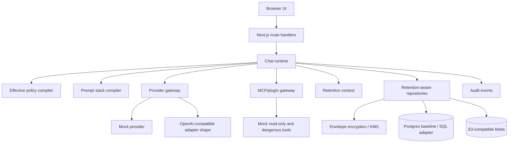

# Architecture

The UI is intentionally thin. Policy, provider selection, retention enforcement, prompt composition, tool permission checks, audit writing, and encryption live in packages used by both API routes and tests.

Single-company mode uses the same tenant-scoped data model as multi-tenant mode. The UI labels tenant-scope configuration as company configuration and hides service/tenant administration surfaces.
